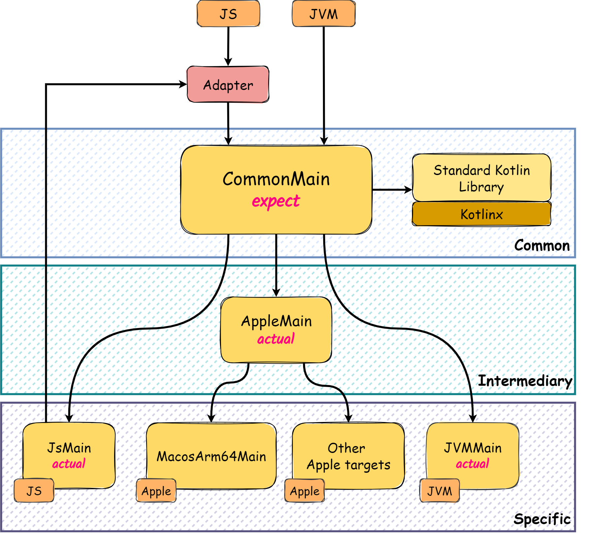

# Experiments

## Table of Contents

- [Kotlin Multiplatform](#kotlin-multiplatform)
    - [Architecture Overview](#architecture-overview)
    - [Testing the Application](#testing-the-application)
    - [Intermediate Source Sets](#intermediate-source-sets)
    - [Adapter](#adapter)
    - [Relevant Design Choices](#relevant-design-choices)
- [Kotlin-Js Interop](#kotlin-js-interop)
    - [Javascript to Kotlin](#javascript-to-kotlin)
        - [Demonstrations](#demonstrations)
        - [NPM Dependencies](#npm-dependencies)
        - [Build and Run](#build-and-run)
    - [Kotlin to Javascript](#kotlin-to-javascript)
        - [Demonstration](#demonstration)
        - [Run](#run)
    - [References](#references)
- [Ktor Framework](#ktor-framework)
    - [Server](#server)
        - [Launching the Application](#launching-the-application)
        - [Define Application Module](#define-application-module)
        - [Installing Plugins](#installing-plugins)
        - [Defining Routes](#defining-routes)
        - [Testing the Application](#testing-the-application-1)
    - [Client](#client)
        - [Requests](#requests)
        - [Responses](#responses)
    - [Demonstration](#demonstration-1)

## Kotlin Multiplatform

> The [Kotlin Multiplatform](https://kotlinlang.org/docs/multiplatform.html) (KMP) technology facilitates the sharing of
> application code across several platforms,
> leveraging the multiplatform capabilities of the Kotlin language to enable the development of a unified codebase
> compiled for various platforms.

Module: [kmp](./kmp)

### Architecture Overview

The KMP architecture is composed of **three** main categories:

- **Common**: Code shared across all platforms (i.e., `CommonMain`, `CommonTest`);
- **Intermediary**: Code that can be shared on a particular set of platforms.
  See [Intermediate Source Sets](#intermediate-source-sets);
- **Specific**: Platform-specific code (i.e., `<Platform>Main`, `<Platform>Test`).

The main goal is to maximize code reuse, meaning to aggregate as much code as possible in the **Common** category.
However, sometimes it's necessary to create specific code for a **target** platform in the
following situations:

1. A certain functionality cannot be implemented commonly because:

    - It requires access to specific target APIs;
    - The libraries available for common code _(i.e., Standard Kotlin Library, Kotlinx)_ do not cover the desired
      functionalities,
      and there's no external KMP-compatible library available to be used as a dependency (or it is discouraged to use);

2. A certain target does not directly support KMP _(e.g., Node.js)_, and thus an [adapter](#adapter) is needed for the
   code to be callable from the target.

To create specific code for a target, the `expect/actual` mechanism is used, which allows defining the code to be
implemented and its target implementation, respectively.

Example:

```kotlin
// commonMain
expect fun platformName(): String

// jvmMain
actual fun platformName(): String = "JVM"

// jsMain
actual fun platformName(): String = "JS"
```

|  |
|:-------------------------------------------------------------------------------:|
|                            KMP Architecture Overview                            |

### Testing the Application

In the [KMP template](https://github.com/Kotlin/multiplatform-library-template) provided by _Kotlin_,
the example with the `fibonacci` sequence was removed
and replaced by a few examples to practice the `expect/actual` mechanism more thoroughly.

This [addition](./kmp/src/commonMain/kotlin) follows the same principles:

- **test common functionality** in [CommonTest](./kmp/src/commonTest/kotlin);
- **test platform-specific functionality** in each platform's test source set (`<Platform>Test`)

To run the tests for all supported targets, use the command:

```bash
# from root or within a run configuration 
./gradlew :kmp:cleanAllTests :kmp:allTests --rerun-tasks
```

### Intermediate Source Sets

[Intermediate Source Sets](https://kotlinlang.org/docs/multiplatform-discover-project.html#intermediate-source-sets)
enable sharing code
across more than one platform,
yet not encompassing all, as that would be the role of the common source set.

|  |
|:--------------------------------------------------------------------------------------:|
|                            Intermediate Source Set Example                             |

The dependencies between source sets can be configured within the corresponding `build.gradle.kts` file,
as mentioned [here](https://kotlinlang.org/docs/multiplatform-hierarchy.html#manual-configuration).

> [!IMPORTANT]
> Both `iOS` and `macOs` source sets were removed from the template,
> because there is no `macOS x86-64` host available for testing, as required by Apple.

### Adapter

The **adapter** is a module that allows code defined in a _KMP_ project to be called from a target that does not
directly support _KMP_ and
_Kotlin_ in general.

For demonstration purposes,
a pure [JS application](./js-app/src/main/js/server.mjs) was created
to call the [adapter](./kmp/src/jsMain/kotlin/Adapter.js.kt)
defined in the `JsMain` _sorceset_ of the `kmp` module,
essentially acting as a consumer.

#### Build and Run

```bash
# from root
./gradlew kmp:jsNodeDevelopment
```

```bash
# from root
node js-app/src/main/js/server.mjs
# take a look at the express paths and PORT configured in the server
# open an HTTP client and access http://localhost:PORT
```

For more information about _Kotlin_ and _JavaScript_ interop, see [Kotlin-Js Interop](#kotlin-js-interop) section.

### Relevant Design Choices

As mentioned in the [issue](https://youtrack.jetbrains.com/issue/KT-61573), the `expect/actual` pattern
should only be used for `functions` and `interfaces`.
An alternative for this pattern is to use `expect fun` + `interface` in the common module.

|  |
|:---------------------------------------------------------------:|
|                            KT-61573                             |

## Kotlin-Js Interop

> The Kotlin-Js Interop is a feature of Kotlin/JS that allows the use of JavaScript libraries in Kotlin code and vice
> versa.

Module: [kotlin-js-interop](./kotlin-js-interop)

### Javascript to Kotlin

#### Demonstrations

<table>
<tr>
<td> <strong> Javascript </strong> </td> <td> <strong> Kotlin </strong> </td>
</tr>
<tr>
<td>

[func-export.js](./kotlin-js-interop/src/main/js/func-export.mjs)

</td>
<td>

[jsFuncImport.kt](./kotlin-js-interop/src/main/kotlin/kjs/jsFuncImport.kt)

</tr>
<tr>
<td>

[file-export.js](./kotlin-js-interop/src/main/js/file-export.mjs)

</td>
<td>

[jsFileImport.kt](/kotlin-js-interop/src/main/kotlin/kjs/jsFileImport.kt)

</td>
</tr>
</table>

#### NPM Dependencies

To use [NPM](https://www.npmjs.com/) dependencies in _Kotlin/JS_,
the dependencies must be added to the `dependencies` block of the `build.gradle.kts` file.

```kotlin
dependencies {
    // Install npm dependencies
    implementation(npm("randomstring", "1.3.0"))
}
```

And then define the exported function according to the JavaScript library's API.

<table>
<tr>
<td> <strong> Javascript </strong> </td> <td> <strong> Kotlin </strong> </td>
</tr>
<tr>
<td>

```javascript
var randomstring = require("randomstring");

randomstring.generate();
// >> "XwPp9xazJ0ku5CZnlmgAx2Dld8SHkAeT"

randomstring.generate(7);
// >> "xqm5wXX"
```

</td>
<td>

```kotlin
@JsModule("randomstring")
@JsNonModule
external object RandomStringFromNpm {
    fun generate(
        length: Int = definedExternally,
    ): String
}
```

</td>
</table>

> [!TIP]
> To delegate default parameter value to the imported JavaScript function, use `definedExternally`.

#### Build and Run

```bash
# from root
./gradlew kotlin-js-interop:nodeDevelopmentRun
```

### Kotlin to Javascript

#### Demonstration

<table>
<tr>
<td> <strong> Kotlin </strong> </td> <td> <strong> Javascript </strong>  </td>
</tr>
<tr>
<td>

[Person.kt](./kotlin-js-interop/src/main/kotlin/kjs/Person.kt)

</td>
<td>

[importing.js](./kotlin-js-interop/src/main/js/importing.mjs)

</td>
</table>

#### Run

```bash
# from root
node kotlin-js-interop/src/main/js/importing.mjs
```

### References

- [Kotlinlang: JS to Kotlin Interop](https://kotlinlang.org/docs/js-to-kotlin-interop.html)
- [Kotlinlang: Kotlin to JS Interop](https://kotlinlang.org/docs/js-interop.html)
- [Kotlinlang: Dependencies from NPM](https://kotlinlang.org/docs/using-packages-from-npm.html)
- [Kt.Academy: JS Interop](https://kt.academy/article/ak-js-interop)
- [Dev.to: @JsExport guide for exposing Kotlin to JS](https://dev.to/touchlab/jsexport-guide-for-exposing-kotlin-to-js-20l9)

## Ktor Framework

> [Ktor](https://ktor.io) is a modular framework for developing asynchronous server and client applications.
>
> Developed by _JetBrains_, it was built with pure _Kotlin_ and is integrated with
> the [Coroutines](https://github.com/Kotlin/kotlinx.coroutines)
> system. This system allows asynchronous code to be defined sequentially
> and can be executed without blocking threads, taking greater advantage of the computing system
> available

Module: [ktor](./ktor)

### Server

#### Launching the Application

The application can be launched using the `Application` class.

```kotlin
fun main() {
    embeddedServer(Netty, port = 8000) {
        // ...
    }.start(wait = true)
}
```

#### Define Application Module

In _Ktor_, the application module is defined using the `Application` class.

```kotlin
fun Application.module() {
    // ...
}
```

#### Installing Plugins

A plugin can be installed using the `install` function and configured using its **last parameter function** (_trailing
lambda_).

```kotlin
fun Application.module() {
    install(DefaultHeaders) {
        header("X-Engine", "Ktor")
    }
    install(CallLogging) {
        level = Level.INFO
        filter { call -> call.request.path().startsWith("/api") }
    }
    install(WebSockets) {
        // configuration if needed
    }
    // install(...)
}
```

To use specific plugins, they must be added to the dependencies in the correspondent `build.gradle.kts` file.

```kotlin
implementation("io.ktor:ktor-server-default-headers")
implementation("io.ktor:ktor-server-call-logging")
implementation("io.ktor:ktor-server-websockets")
```

#### Defining Routes

Routes can be defined using the `routing` function.

```kotlin
fun Application.module() {
    routing {
        get("/") {
            call.respondText("Hello, World!")
        }
        get("/json") {
            call.respond(mapOf("hello" to "world"))
        }
        // ...
    }
}
```

#### Testing the Application

To test the application, you can utilize the `testApplication` function, which provides access to a `client` object for
making requests to the server.

Example:

```kotlin
testApplication {
    val log = arrayListOf<String>()
    // We perform a test websocket connection to this route. Effectively acting as a client.
    // The [incoming] parameter allows receiving frames, while the [outgoing] allows sending frames to the server.
    val client = client.config {
        install(WebSockets)
    }
    client.webSocket("/ws") {
        outgoing.send(Frame.Text("HELLO"))
        for (n in 0 until 2) {
            log += (incoming.receive() as Frame.Text).readText()
        }
    }
    assertEquals(listOf("Member joined", "HELLO"), log)
}
```

### Client

Similar to the `Application` class as seen in the [Server](#server) section,
the `HttpClient` class can be used to perform requests to a server and install plugins.

```kotlin
val client = HttpClient(CIO) {
    install(Logging)
    // install(...)
}
```

#### Requests

The `client` object can be used to make requests to the server.

```kotlin
val response: HttpResponse = client.get("http://localhost:8080")
```

```kotlin
@Serializable
data class Customer(val id: Int, val firstName: String, val lastName: String)

val response: HttpResponse = client.post("http://localhost:8080/customer") {
    contentType(ContentType.Application.Json)
    setBody(Customer(3, "Jet", "Brains"))
}
```

More examples [at](https://ktor.io/docs/request.html).

#### Responses

The `HttpResponse` object can be used to access the response's status code, headers, and body.

```kotlin
val httpResponse: HttpResponse = client.get("https://ktor.io/")
val stringBody: String = httpResponse.body()
```

More examples [at](https://ktor.io/docs/response.html).

### Demonstration

#### Server

To start the server, run the following command:

```bash
# from root
./gradlew ktor:backendJvmRun -DmainClass=MainKt --quiet
```

Code at [Main.kt](./ktor/src/backendJvmMain/kotlin/Main.kt).
Static files at [resources](./ktor/src/backendJvmMain/resources/web).

#### Javascript Client

In any http client, access `http://localhost:8080` and interact with the UI.

Code at [frontendJs](./ktor/src/frontendJsMain/kotlin).

#### Android Client

To expose the server to the internet, use [ngrok](https://ngrok.com/) and in its terminal run:

```bash
ngrok http http://localhost:8080
```

Grab the url string and replace the `host` parameter in
the [android-config](ktor/src/frontendAndroidMain/kotlin/config/Config.android.kt) file.

Run the application on an emulator or physical device.

Code at [android-app](./android-app/src/main/java/android/ChatActivity.kt).
