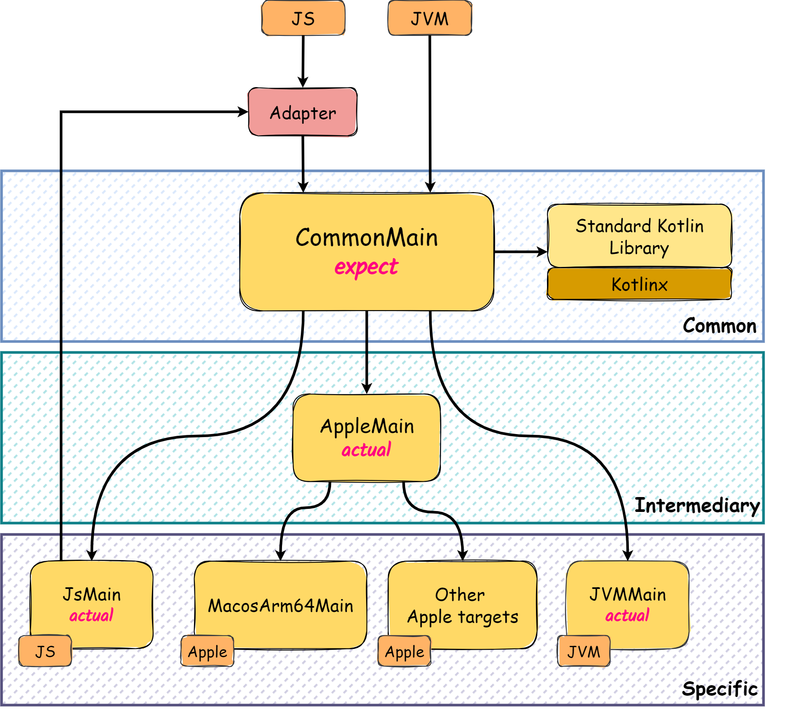

# Kotlin Multiplatform

> The [Kotlin Multiplatform](https://kotlinlang.org/docs/multiplatform.html) (KMP) technology facilitates the sharing of
> application code across several platforms. 

## Table of Contents

- [Architecture Overview](#architecture-overview)
- [Testing the Application](#testing-the-application)
- [Intermediate Source Sets](#intermediate-source-sets)
- [Adapter](#adapter)
- [Relevant Design Choices](#relevant-design-choices)

### Architecture Overview

The KMP architecture is composed of **three** main categories:

- **Common**: Code shared across all platforms (i.e., `CommonMain`, `CommonTest`);
- **Intermediary**: Code that can be shared on a particular set of platforms.
  See [Intermediate Source Sets](#intermediate-source-sets);
- **Specific**: Platform-specific code (i.e., `<Platform>Main`, `<Platform>Test`).

The main goal is to maximize code reuse, meaning to aggregate as much code as possible in the **Common** category.
However, sometimes it's necessary to create specific code for a **target** platform in the
following situations:

1. A certain functionality cannot be implemented commonly because:

    - It requires access to specific target APIs;
    - The libraries available for common code _(i.e., Standard Kotlin Library, Kotlinx)_ do not cover the desired
      functionalities,
      and there's no external KMP-compatible library available to be used as a dependency (or it is discouraged to use);

2. A certain target does not directly support KMP _(e.g., Node.js)_, and thus an [adapter](#adapter) is needed for the
   code to be callable from the target.

To create specific code for a target, the `expect/actual` mechanism is used, which allows defining the code to be
implemented and its target or sub-target implementation, respectively.

Example:

```kotlin
// commonMain
expect fun platformName(): String

// jvmMain
actual fun platformName(): String = "JVM"

// jsMain
actual fun platformName(): String = "JS"
```

|  |
|:--------------------------------------------------------------------------------:|
|                            KMP Architecture Overview                             |

### Testing the Application

In the [KMP template](https://github.com/Kotlin/multiplatform-library-template) provided by _Kotlin_,
the example with the `fibonacci` sequence was removed
and replaced by a few examples to practice the `expect/actual` mechanism more thoroughly.

This [addition](lib/src/commonMain/kotlin) follows the same principles:

- **test common functionality** in [CommonTest](lib/src/commonTest/kotlin);
- **test platform-specific functionality** in each platform's test source set (`<Platform>Test`)

To run the tests for all supported targets, use the command:

```bash
# from root or within a run configuration 
./gradlew :kmp:lib:cleanAllTests :kmp:lib:allTests --rerun-tasks
```

### Intermediate Source Sets

[Intermediate Source Sets](https://kotlinlang.org/docs/multiplatform-discover-project.html#intermediate-source-sets)
enable sharing code
across a subset of platforms, allowing for more flexibility in the code sharing strategy.

|  |
|:---------------------------------------------------------------------------------------:|
|                             Intermediate Source Set Example                             |

In the corresponding `build.gradle.kts` file, the dependencies between source sets can be configured [manually](https://kotlinlang.org/docs/multiplatform-hierarchy.html#manual-configuration)
or by using `applyDefaultHierarchyTemplate()` which builds the hierarchy of the provided targets [automatically](https://kotlinlang.org/docs/multiplatform-hierarchy.html#default-hierarchy-template).

> [!IMPORTANT]
> Both `iOS` and `macOs` source sets were removed from this build,
> because there is no `macOS x86-64` host available for testing, as required by Apple.

### Adapter

The **adapter** is a module that allows code defined in a _KMP_ project to be called from a target that does not
directly support _KMP_ and
_Kotlin_ in general.

For demonstration purposes,
a pure [JS application](apps/js-app/src/server.mjs) was created
to call the [adapter](lib/src/jsMain/kotlin/Adapter.js.kt)
defined in the `JsMain` _sorceset_, essentially acting as a consumer.

To run the application:

1. Execute the perl [script](./apps/js-app/npm-link-script.pl) to link local npm packages in this project.
2. Run the server:
    ```bash
    node kmp/apps/js-app/src/server.mjs
    # take a look at the express paths and PORT configured in the server
    # open an HTTP client and access http://localhost:PORT
    ```

For more information about _Kotlin_ and _JavaScript_ interop, see [Kotlin-Js Interop](../kotlin-js-interop) section.

### Relevant Design Choices

As mentioned in this [issue](https://youtrack.jetbrains.com/issue/KT-61573), the `expect/actual` pattern
should only be used for `functions` and `interfaces`.
An alternative for this pattern is to use `expect fun` + `interface` in the common module.

|  |
|:----------------------------------------------------------------:|
|                             KT-61573                             |
