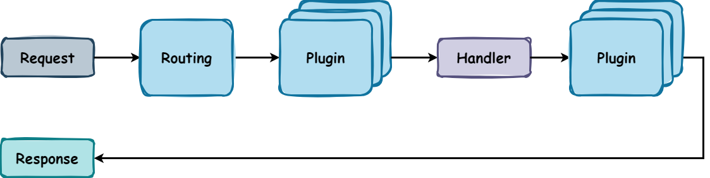
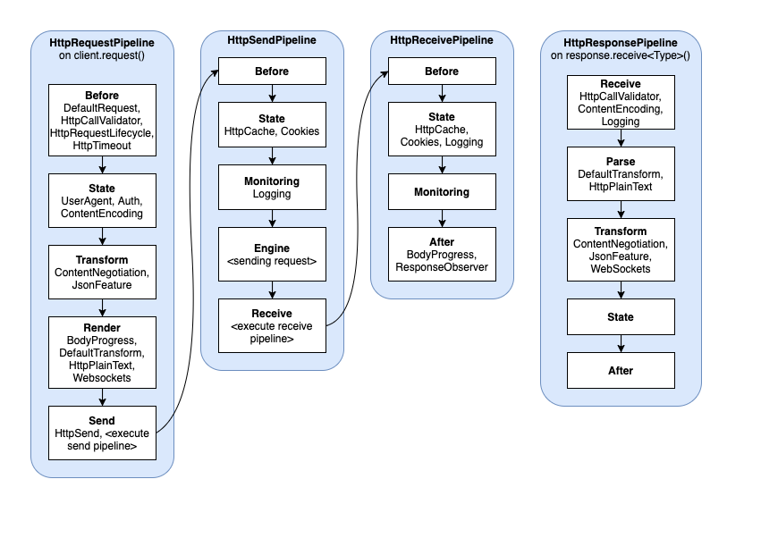

# Ktor Custom Plugin

## Table of Contents

- [Plugin](#plugin)
- [Server](#server)
    - [Pipelines](#pipelines)
    - [Handle Calls](#handle-calls)
    - [Handle Application Events](#handle-application-events)
    - [Create Plugin](#create-plugin)
    - [Install](#install)
- [Client](#client)
    - [Pipelines](#pipelines-1)
    - [Handle Requests and Responses](#handle-requests-and-responses)
    - [Create Plugin](#create-plugin-1)
    - [Install](#install-1)

## Plugin

A plugin is a reusable component that can be installed in an application to extend its functionality.
In Ktor,
plugins are used to add custom behavior (e.g., logging, authentication, monitoring) to the server or client application.

## Server

[Module](server-custom-plugin/README.md) | [Docs](https://ktor.io/docs/server-custom-plugins.html)

### Pipelines

A Pipeline in Ktor is a collection of interceptors, grouped in one or more ordered phases. Each interceptor can
perform custom logic before and after processing a request.

|  |
|:---------------------------------------------------------------------:|
|                        *Pipeline Architecture*                        |

> [!NOTE]
> A plugin is also an interceptor, but an interceptor is not a plugin.
> While an interceptor is a function that can be added to intercept a specific pipeline phase and perform custom logic,
> a plugin can be a collection of interceptors mixed with external configuration and other logic (e.g., add more
> pipeline phases)
> in a single reusable component.

Many applications require common functionality that is out of scope of the application logic
(e.g., serialization, content encoding, compression, headers, cookie support, etc).
All of these are provided in Ktor as plugins.

As a `request` comes in:

- It is routed to the correct handler via the routing mechanism (which
  is [also a plugin](https://ktor.io/docs/server-plugins.html#routing));
- before being handed off to the handler, it goes through one or more Plugins;
- the handler (application logic) handles the request;
- before the response is sent to the client, it goes through one or more Plugins

The `request/response` flow in the server pipeline is as follows:

|  |
|:---------------------------------------------------------:|
|                     *Server Pipeline*                     |

Available pipelines in `ktor-server` are:

- [ApplicationSendPipeline](https://api.ktor.io/ktor-server/ktor-server-core/io.ktor.server.response/-application-send-pipeline/-phases/index.html):
  responsible for sending responses. It has the following phases:
    - `Before`: the earliest phase that happens before any other;
    - `Transform`: a transformation phase that can proceed with any supported data like String;
    - `Render`: a phase to render any current pipeline subject into `OutgoingContent`. Beyond this phase,
      only `OutgoingContent` should be produced by any interceptor;
    - `Content-Encoding`: a phase for processing `Content-Encoding`, like compression and partial content;
    - `Transfer-Encoding`: a phase for handling `Transfer-Encoding`, like if chunked encoding is being done manually and
      not
      by the engine;
    - `After`: the latest phase that happens right before an engine sends a response;
    - `Engine`: a phase for the engine to send the response out to the client.
- [ApplicationReceivePipeline](https://api.ktor.io/ktor-server/ktor-server-core/io.ktor.server.request/-application-receive-pipeline/-phases/index.html):
  responsible for receiving requests. It has the following phases:
    - `Before`: executes before any transformations are made;
    - `Transform`: executes transformations;
    - `After`: executes after all transformations.
- [ApplicationCallPipeline](https://api.ktor.io/ktor-server/ktor-server-core/io.ktor.server.application/-application-call-pipeline/-application-phase/index.html):
  responsible for executing application calls, which encompasses the two previous pipelines. It has the following
  phases:
    - `Setup`: phase for preparing call and it's attributes for processing;
    - `Monitoring`: phase for tracing calls, useful for logging, metrics, error handling and so on;
    - `Plugins`: phase for plugins. Most plugins should intercept this phase;
    - `Call`: phase for processing a call and sending a response;
    - `Fallback`: phase for handling unprocessed calls.

### Handle Calls

In the custom plugin, you can handle requests and responses by using a set of handlers that provide access to different
stages of a call:

- `onCall`: allows you to get request/response information, modify response parameters (for instance, append custom
  headers), and so on;
- `onCallReceive`: allows you to obtain and transform data received from the client;
- `onCallRespond` allows you to transform data before sending it to the client;
- `on(...)` allows you to invoke specific hooks that might be useful to handle other stages of a call or exceptions that
  happened during a call. Examples:
    - `CallSetup`: invoked as a first step in processing a call.
    - `ResponseBodyReadyForSend`: invoked when a response body comes through all transformations and is ready to be
      sent.
    - `ResponseSent`: invoked when a response is successfully sent to a client.
    - `CallFailed`: invoked when a call fails with an exception.

> [!NOTE]
> If required,
> it is possible
> to [share a call state](https://ktor.io/docs/server-custom-plugins.html#call-state) between different handlers
> using `call.attributes` collection.

### Handle Application Events

To handle application events, you can use the `on` function with the `MonitoringEvent` hook. This class provides access
to the following events:

```kotlin
val ApplicationMonitoringPlugin = createApplicationPlugin(name = "ApplicationMonitoringPlugin") {
    on(MonitoringEvent(ApplicationStarted)) { application ->
        application.log.info("Server is started")
    }
    on(MonitoringEvent(ApplicationStopped)) { application ->
        application.log.info("Server is stopped")
        // Release resources and unsubscribe from events
        application.environment.monitor.unsubscribe(ApplicationStarted) {}
        application.environment.monitor.unsubscribe(ApplicationStopped) {}
    }
    on(ResponseSent) { call ->
        if (call.response.status() == HttpStatusCode.NotFound) {
            this@createApplicationPlugin.application.environment.monitor.raise(NotFoundEvent, call)
        }
    }
}

val NotFoundEvent: EventDefinition<ApplicationCall> = EventDefinition()
```

See all available events [here](https://ktor.io/docs/server-custom-plugins.html#handle-app-events).

### Create Plugin

To create a custom server plugin, use the `createApplicationPlugin` function. This function takes the following
parameters:

- `name`: a unique name for the plugin;
- `createConfiguration`: an optional configuration class for the plugin;
- `block`: a lambda function that defines the plugin behavior which has access to [handle calls](#handle-calls)
  and [application events](#handle-application-events).

Basic example:

```kotlin
val RequestLoggingPlugin = createApplicationPlugin("RequestLoggingPlugin") {
    onCall { call ->
        println(call.request.uri)
    }
}
```

With configuration:

```kotlin
val CustomHeaderPlugin = createApplicationPlugin(
    name = "CustomHeaderPlugin",
    createConfiguration = ::PluginConfiguration
) {
    val headerName = pluginConfig.headerName
    val headerValue = pluginConfig.headerValue
    pluginConfig.apply {
        onCall { call ->
            call.response.headers.append(headerName, headerValue)
        }
    }
}

class PluginConfiguration {
    var headerName: String = "Custom-Header-Name"
    var headerValue: String = "Default value"
}
```

> [!NOTE]
> A [configuration file](https://ktor.io/docs/server-custom-plugins.html#configuration-file) can also be used to define
> the plugin configuration.

### Install

Install the plugin in the application by using the `install` function:

```kotlin
fun Application.module() {
    install(RequestLoggingPlugin)
    install(CustomHeaderPlugin) {
        headerName = "X-Custom-Header"
        headerValue = "Hello, world!"
    }
}
```   

## Client

[Module](client-custom-plugin/README.md) | [Docs](https://ktor.io/docs/client-custom-plugins.html)

### Pipelines

Similar to the [server](#pipelines), the client also has different pipelines, each with its own set of predefined
phases for handling requests and responses.

Available pipelines in `ktor-client` are:

- [HttpRequestPipeline](https://api.ktor.io/ktor-client/ktor-client-core/io.ktor.client.request/-http-request-pipeline/-phases/index.html):
  A pipeline used for processing all requests sent by this client. It has the following phases:
    - `Before`: The earliest phase that happens before any other;
    - `State`: Use this phase to modify a request with a shared state;
    - `Transform`: Transform a request body to supported render format;
    - `Render`: Encode a request body to `OutgoingContent`;
    - `Send`: A phase for the `HttpSend` plugin.
- [HttpSendPipeline](https://api.ktor.io/ktor-client/ktor-client-core/io.ktor.client.request/-http-send-pipeline/-phases/index.html):
  A pipeline used for sending a request. It has the following phases:
    - `Before`: The earliest phase that happens before any other;
    - `State`: Use this phase to modify a request with a shared state;
    - `Monitoring`: Use this phase for logging and other actions that don't modify a request or shared data;
    - `Engine`: Send a request to a remote server;
    - `Receive`: Receive a pipeline execution phase.
- [HttpReceivePipeline](https://api.ktor.io/ktor-client/ktor-client-core/io.ktor.client.statement/-http-receive-pipeline/-phases/index.html):
  A pipeline used for receiving a response without processing. It has the following phases:
    - `Before`: The earliest phase that happens before any other;
    - `State`: Use this phase to store request shared state;
    - `After`: Latest response pipeline phase.
- [HttpResponsePipeline](https://api.ktor.io/ktor-client/ktor-client-core/io.ktor.client.statement/-http-response-pipeline/-phases/index.html):
  A pipeline used for processing responses. It has the following phases:
    - `Receive`: The earliest phase that happens before any other;
    - `Parse`: Decode response body;
    - `Transform`: Transform response body to expected format;
    - `State`: Use this phase to store request shared state;
    - `After`: Latest response pipeline phase.

|  |
|:-----------------------------------------------------------:|
|                     *Client Pipelines*                      |

### Handle Requests and Responses

Custom plugins provide access to different stages of handling requests and responses using a set of dedicated handlers (
i.e., hooks):

- `on(SetupRequest)`: Executed first in request processing;
- `onRequest`: Executed for each HTTP request and allows you to modify it;
- `transformRequestBody`: Allows you to transform a request body;
- `onSend`: Provides the ability to inspect a response and initiate additional requests if needed. This might be useful
  for handling redirects, retrying requests, authentication, and so on.
- `on(SendingRequest)`: Executed for every request, even if it's not initiated by a user. For example, if a request
  results in a redirect, the `onRequest` handler will be executed only for the original request,
  while `on(SendingRequest)` will be executed for both original and redirected requests. Similarly, if you
  used `on(Send)` to initiate an additional request, handlers will be ordered as follows:
    - --> onRequest
    - --> on(Send)
    - --> on(SendingRequest)
    - <-- onResponse
    - --> on(SendingRequest)
    - <-- onResponse
- `onResponse`: Allows you to transform a response body;
- `onClose`: Allows you to clean resources allocated by a plugin. This handler is called when the client is closed.

### Create Plugin

The client plugin is created in a [similar way to the server plugin](#create-plugin),
the only difference is that the client plugin is created using the `createClientPlugin` function and has access to
different [hooks](#handle-requests-and-responses).

Example:

```kotlin
val ResponseTimePlugin = createClientPlugin("ResponseTimePlugin") {
    val onCallTimeKey = AttributeKey<Long>("onCallTimeKey")
    on(SendingRequest) { request, content ->
        val onCallTime = System.currentTimeMillis()
        request.attributes.put(onCallTimeKey, onCallTime)
    }

    onResponse { response ->
        val onCallTime = response.call.attributes[onCallTimeKey]
        val onCallReceiveTime = System.currentTimeMillis()
        println("Read response delay (ms): ${onCallReceiveTime - onCallTime}")
    }
}
```

### Install

Install the plugin in the client by using the `install` function:

```kotlin
val client = HttpClient {
    install(ResponseTimePlugin)
}
```
