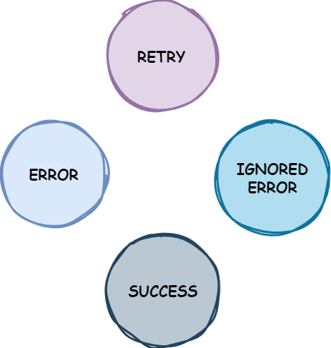

# Resilience4j

> [Resilience4j](https://resilience4j.readme.io/docs) is a fault tolerance library designed for Java8 and functional
> programming.

## Table of Contents

1. [Retry](#retry)
   - [Configuration](#configuration)
   - [Registry](#registry)
   - [States](#states)
   - [Decorators](#decorators)
   - [Interval Functions](#interval-functions)
   - [Events](#events)
     - [Mechanism](#mechanism)
     - [Registry](#registry)
   - [Async vs Sync](#async-vs-sync)

## Retry

[Main Implementation Module](https://github.com/resilience4j/resilience4j/blob/master/resilience4j-retry/src/main/java/io/github/resilience4j/retry/internal/RetryImpl.java)

### Configuration

<table>
    <tr>
        <th>Config property</th>
        <th>Default value</th>
        <th>Description</th>
    </tr>
    <tr>
        <td>maxAttempts</td>
        <td><code>3</code></td>
        <td>The maximum number of attempts (including the initial call as the first attempt).</td>
    </tr>
    <tr>
        <td>waitDuration</td>
        <td><code>500 [ms]</code></td>
        <td>A fixed wait duration between retry attempts.</td>
    <tr>
        <td>intervalFunction</td>
        <td><code>numOfAttempts -> waitDuration</code></td>
        <td>A function to modify the waiting interval after a failure. By default the wait duration remains constant.</td>
    </tr>
    <tr>
        <td>intervalBiFunction</td>
        <td><code>(numOfAttempts, Either&ltthrowable, result&gt) -> waitDuration</code></td>
        <td>A function to modify the waiting interval after a failure based on attempt number and a result or exception.</td>
    </tr>
    <tr>
        <td>retryOnResultPredicate</td>
        <td><code>result -> false</code></td>
        <td>Configures a <code>Predicate</code> which evaluates if a result should be retried. The <code>Predicate</code> must return <code>true</code>, if the result should be retried, otherwise it must return <code>false</code>.</td>
    </tr>
    <tr>
        <td>retryExceptions</td>
        <td><code>empty</code></td>
        <td>Configures a list of <code>Throwable</code> classes that are recorded as a failure and thus are retried. This parameter supports subtyping.</td>
    </tr>
    <tr>
        <td>ignoreExceptions</td>
        <td><code>empty</code></td>
        <td>Configures a list of <code>Throwable</code> classes that are ignored and thus are not retried. This parameter supports subtyping.</td>
    </tr>
    <tr>
        <td>failAfterMaxAttempts</td>
        <td><code>false</code></td>
        <td>A boolean to enable or disable throwing of <code>MaxRetriesExceededException</code> when the <code>Retry</code> has reached the configured <code>maxAttempts</code>, and the result is still not passing the <code>retryOnResultPredicate</code></td>
    </tr>
</table>

From: [Retry](https://resilience4j.readme.io/docs/retry#create-and-configure-retry)

> [!IMPORTANT]   
> In the <code>Retry</code> configuration the <code>intervalFunction</code> and <code>intervalBiFunction</code> are
> mutually exclusive.
> If both are set it will throw a <code>IllegalStateException</code>.

The configuration uses the [builder](https://en.wikipedia.org/wiki/Builder_pattern) pattern to create a `RetryConfig` instance:

```java
RetryConfig config = RetryConfig.custom()
  .maxAttempts(2)
  .waitDuration(Duration.ofMillis(1000))
  .retryOnResult(response -> response.getStatus() == 500)
  .retryOnException(e -> e instanceof WebServiceException)
  .retryExceptions(IOException.class, TimeoutException.class)
  .ignoreExceptions(BusinessException.class, OtherBusinessException.class)
  .failAfterMaxAttempts(true)
  .build();
```

Or using default configuration:

```java
RetryConfig config = RetryConfig.ofDefaults();
```

### Registry

A register is used to store and manage multiple `Retry` instances. In the registry, the `Retry` instances are identified by a name.

Register a `Retry` instance in the `RetryRegistry` with a configuration:

```java
RetryRegistry registry = RetryRegistry.of(config);
Retry retry = registry.retry("name");
```

Or: 

```java
Retry retry = Retry.of("name", config);
```

This module also provides an in-memory implementation of the `RetryRegistry`.

### States

The `Retry` mechanism has the following states:

|  |
|:------------------------------------------------------------------------:|
|                               Retry States                               |

- `RETRY`: The retry is in progress;
- `ERROR`: The retry has failed (e.g., the max attempts were reached);
- `SUCCESS`: The retry has succeeded;
- `IGNORED_ERROR`: The retry has failed, but the exception was ignored as it belongs to the `ignoreExceptions` list.

### Decorators

A decorator is a high-order function that wraps a function and returns a new function with the same signature.

Available decorators:
- [Supplier](https://docs.oracle.com/javase/8/docs/api/java/util/function/Supplier.html);
  - Supplier<[CompletionStage](https://docs.oracle.com/javase/8/docs/api/java/util/concurrent/CompletionStage.html)>;
- [Runnable](https://docs.oracle.com/javase/8/docs/api/java/lang/Runnable.html);
- [Callable](https://docs.oracle.com/javase/8/docs/api/java/util/concurrent/Callable.html);
- [Function](https://docs.oracle.com/javase/8/docs/api/java/util/function/Function.html)

And checked variants provided by the library, which wrap unchecked exceptions that might be thrown:
- CheckedSupplier;
- CheckedRunnable;
- CheckedFunction

Associated with a given high-order function, there is also the capability to:
- `recover`: Provides a function to handle exceptions or errors that might occur during the execution of the high-order function. This recovery mechanism allows the program to gracefully handle errors and continue execution;
- `andThen`: This function enables chaining operations after the execution of the high-order function. It acts similar to a [flatmap](https://dzone.com/articles/understanding-flatmap) operation in functional programming, where the result of the first operation is passed as input to the next operation, allowing for sequential composition of functions and without multiple wrapping of the result.

```java
Retry retry = Retry.of("name", config);
CheckedSupplier<String> retryableSupplier = Retry
        .decorateCheckedSupplier(retry, remoteService::message);
Try<String> result = Try.of(retryableSupplier)
        .recover(throwable -> "Hello from recovery");
```

### Interval Functions

An `IntervalFunction` is used to calculate the wait duration between retry attempts,
and is called for every retry attempt.

A few examples:

1. Fixed wait interval
    ```java    
    // using defaults
    IntervalFunction defaultWaitInterval = IntervalFunction.ofDefaults();
    // or explicitly
    IntervalFunction fixedWaitInterval = IntervalFunction.of(Duration.ofSeconds(5));
    ```
2. Exponential backoff
    ```java
    // using defaults
    IntervalFunction intervalWithExponentialBackoff = IntervalFunction.ofExponentialBackoff();
    // or explicitly (initial interval [ms], multiplier)
    IntervalFunction intervalWithExponentialBackoff = IntervalFunction.ofExponentialBackoff(100, 2);
    ```
3. Randomized
    ```java
    IntervalFunction randomWaitInterval = IntervalFunction.ofRandomized();
    ```
   
4. Custom
    ```java
    IntervalFunction customIntervalFunction =
                IntervalFunction.of(1000, nrOfAttempts -> nrOfAttempts + 1000);
    ```

### Events

An `EventPublisher` is used
to register event listeners in both the underlying retry mechanism and the registry where the registered retries are stored.

#### Mechanism

```java
Retry retry = Retry.of("name", config);
retry.getEventPublisher()
    .onRetry(event -> logger.info("Event: " + event.getEventType()))
    .onError(event -> logger.info("Error: " + event.getEventType()))
    .onIgnoredError(event -> logger.info("Ignored error: " + event.getEventType()))
    .onSuccess(event -> logger.info("Success: " + event.getEventType()));
```

#### Registry

```java 
RetryRegistry registry = RetryRegistry.ofDefaults();
registry.getEventPublisher()
  .onEntryAdded(entryAddedEvent -> {
    Retry addedRetry = entryAddedEvent.getAddedEntry();
    logger.info("Retry {} added", addedRetry.getName());
  })
  .onEntryRemoved(entryRemovedEvent -> {
    Retry removedRetry = entryRemovedEvent.getRemovedEntry();
    logger.info("Retry {} removed", removedRetry.getName());
  });
```

### Async vs Sync

The `Retry` instance can be used in both synchronous and asynchronous contexts,
which abide by the following interfaces, respectively:

#### Synchronous

```java
public interface Context<T> {
    void onComplete();
    boolean onResult(T result);
    void onError(Exception exception) throws Exception;
    void onRuntimeError(RuntimeException runtimeException);
}
```

#### Asynchronous

```java
public interface AsyncContext<T> {
    void onComplete();
    long onError(Throwable throwable);
    long onResult(T result);
}
```
