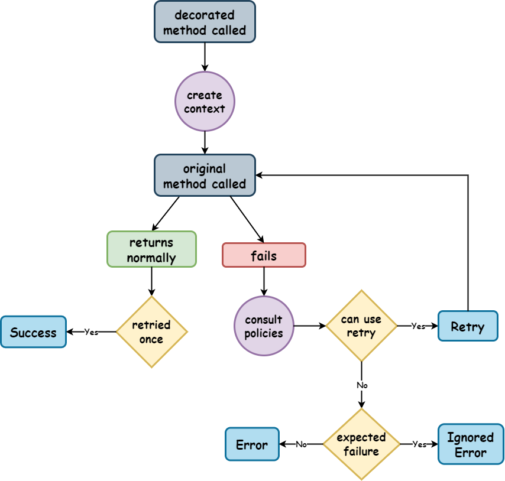
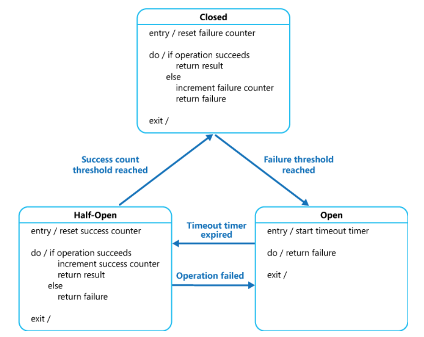

# Resilience4j

> [Resilience4j](https://resilience4j.readme.io/docs) is a fault tolerance library designed for Java8 and functional
> programming.

## Table of Contents

1. [Retry](#retry)
    - [Configuration](#configuration)
    - [Registry](#registry)
    - [States](#states)
    - [Decorators](#decorators)
    - [Interval Functions](#interval-functions)
    - [Events](#events)
        - [Mechanism](#mechanism)
        - [Registry](#registry)
    - [Context](#context)
        - [Synchronous](#synchronous)
        - [Asynchronous](#asynchronous)
    - [Kotlin Interop](#kotlin-interop)
        - [Configuration](#configuration-1)
        - [Decorators](#decorators-1)
2. [Circuit Breaker](#circuit-breaker)
    - [State Machine](#state-machine)
    - [Configuration](#configuration-2)
    - [Sliding Window](#sliding-window)
    - [Additional Details](#additional-details)
3. [Kotlin Multiplatform Design](#kotlin-multiplatform-design)
4. [Flow](#flow)

## Retry

Involves retrying an operation or request that has failed due to transient faults or network issues.
It's designed
to enhance the robustness and reliability of the system
by automatically attempting the operation again after a certain period and/or under certain conditions.

[RetryImpl](https://github.com/resilience4j/resilience4j/blob/9ed5b86fa6add55ee32a733e8ed43058a3c9ec63/resilience4j-retry/src/main/java/io/github/resilience4j/retry/internal/RetryImpl.java)

### Configuration

<table>
    <tr>
        <th>Config property</th>
        <th>Default value</th>
        <th>Description</th>
    </tr>
    <tr>
        <td>maxAttempts</td>
        <td><code>3</code></td>
        <td>The maximum number of attempts <strong>(including the initial call as the first attempt)</strong>.</td>
    </tr>
    <tr>
        <td>waitDuration</td>
        <td><code>500 [ms]</code></td>
        <td>A fixed wait duration between retry attempts.</td>
    <tr>
        <td>intervalFunction</td>
        <td><code>numOfAttempts -> waitDuration</code></td>
        <td>A function to modify the waiting interval after a failure. By default the wait duration remains constant.</td>
    </tr>
    <tr>
        <td>intervalBiFunction</td>
        <td><code>(numOfAttempts, Either&ltthrowable, result&gt) -> waitDuration</code></td>
        <td>A function to modify the waiting interval after a failure based on attempt number and a result or exception.</td>
    </tr>
    <tr>
        <td>retryOnResultPredicate</td>
        <td><code>result -> false</code></td>
        <td>Configures a <code>Predicate</code> which evaluates if a result should be retried. The <code>Predicate</code> must return <code>true</code>, if the result should be retried, otherwise it must return <code>false</code>.</td>
    </tr>
    <tr>
        <td>retryExceptions</td>
        <td><code>empty</code></td>
        <td>Configures a list of <code>Throwable</code> classes that are recorded as a failure and thus are retried. This parameter supports subtyping.</td>
    </tr>
    <tr>
        <td>ignoreExceptions</td>
        <td><code>empty</code></td>
        <td>Configures a list of <code>Throwable</code> classes that are ignored and thus are not retried. This parameter supports subtyping.</td>
    </tr>
    <tr>
        <td>failAfterMaxAttempts</td>
        <td><code>false</code></td>
        <td>A boolean to enable or disable throwing of <code>MaxRetriesExceededException</code> when the <code>Retry</code> has reached the configured <code>maxAttempts</code>, and the result is still not passing the <code>retryOnResultPredicate</code></td>
    </tr>
</table>

From: [Resilience4j Retry Docs](https://resilience4j.readme.io/docs/retry#create-and-configure-retry)

> [!IMPORTANT]   
> In the <code>Retry</code> configuration the <code>intervalFunction</code> and <code>intervalBiFunction</code> are
> mutually exclusive.
> If both are set it will throw a <code>IllegalStateException</code>.


A configuration represents the retry mechanism's behavior - policies - and is used to create a `Retry` instance, which is a
thread-safe instance that holds the [decoration](#decorators) logic and defines the async and
sync [contexts](#context) (i.e., state-holders),
among other funcionalities
(e.g., metrics, [event-publishers](#events)).
A `Retry` instance cannot be created without a custom or default RetryConfig.

The configuration is done using the `RetryConfig` class. It uses the [builder](https://en.wikipedia.org/wiki/Builder_pattern) pattern to create a configuration object:

```java
RetryConfig config = RetryConfig.custom()
        .maxAttempts(2)
        .waitDuration(Duration.ofMillis(1000))
        .retryOnResult(response -> response.getStatus() == 500)
        .retryOnException(e -> e instanceof WebServiceException)
        .retryExceptions(IOException.class, TimeoutException.class)
        .ignoreExceptions(BusinessException.class, OtherBusinessException.class)
        .failAfterMaxAttempts(true)
        .build();
```

Or using default configuration:

```java
RetryConfig config = RetryConfig.ofDefaults();
```

Or by using a base configuration:

```java
RetryConfig baseConfig = RetryConfig.custom()
        .maxAttempts(2)
        .waitDuration(Duration.ofMillis(1000))
        .build();

RetryConfig config = RetryConfig.from(baseConfig);
```

> [!NOTE]
> When using a base configuration, the new configuration will inherit the properties of the base configuration.
> Although, if the new configuration has the same property set, it will override the base configuration's property.

### Registry

The registry is essentially a `getOrCreate` factory method for `Retry` instances.
Its function is to manage (i.e., perform CRUD operations) and to store:

- a collection of `Retry` instances using their designated names as unique identifiers;
- a collection of `RetryConfig` instances using their designated names as unique identifiers.

To register a `Retry` instance in the `RetryRegistry` with a configuration use:

```java
RetryRegistry registry = RetryRegistry.of(config);
Retry retry = registry.retry("name");
```

Or without a registry with:

```java
Retry retry = Retry.of("name", config);
```

> [!IMPORTANT]
> A single `Retry` instance can be used to decorate multiple [decorators](#decorators)
> because internally it creates a
>
new `Retry` [context](https://stackoverflow.com/questions/64052854/resilience4j-new-instance-of-retry-or-retrieve-from-retryregistry)
> per subscription.

### States

A [decorated](#decorators) method with a `Retry` instance can be in one of the following states:

|  |
|:----------------------------------------------------------------------------------------:|
|                                   Retry Execution Flow                                   |

- `RETRY`: A retry attempt was triggered;
- `SUCCESS`: The retry attempt was successful, and thus the next retry attempt is not triggered.
- `IGNORED_ERROR`: The method execution failed, but the retry mechanism was not triggered, since the exception is not
  considered a failure (e.g., the exception is in the `ignoreExceptions` list);
- `ERROR`: The method execution failed, and the retry mechanism was not triggered because configuration conditions were
  not met (e.g., the maximum number of attempts was reached).

> [!NOTE]
> State `IGNORED_ERROR` will propagate the exception to the caller,
> while state `ERROR` will also propagate the exception if the `intervalBiFunction` returns a negative value.

### Decorators

A decorator is a high-order function that wraps a function and returns a new function with the same signature.

Available decorators:

- [Supplier](https://docs.oracle.com/javase/8/docs/api/java/util/function/Supplier.html);
    - Supplier<[CompletionStage](https://docs.oracle.com/javase/8/docs/api/java/util/concurrent/CompletionStage.html)>;
- [Runnable](https://docs.oracle.com/javase/8/docs/api/java/lang/Runnable.html);
- [Callable](https://docs.oracle.com/javase/8/docs/api/java/util/concurrent/Callable.html);
- [Function](https://docs.oracle.com/javase/8/docs/api/java/util/function/Function.html)

And checked variants provided by the library, which wrap unchecked exceptions that might be thrown:

- `CheckedSupplier`;
- `CheckedRunnable`;
- `CheckedFunction`

Associated with a given high-order function, there is also the capability to:

- `recover`: Provides a function to handle exceptions or errors that might occur during the execution of the high-order
  function. This recovery mechanism allows the program to gracefully handle errors and continue execution;
    ```java
    Retry retry = Retry.of("name", config);
    CheckedSupplier<String> retryableSupplier = Retry
        .decorateCheckedSupplier(retry, remoteService::message);
    Try<String> result = Try.of(retryableSupplier)
        .recover(throwable -> "Hello from recovery");
    ```

- `andThen`: This function enables chaining operations after the execution of the high-order function. It acts similar
  to a [flatmap](https://dzone.com/articles/understanding-flatmap) operation in functional programming, where the result
  of the first operation is passed as input to the next operation, allowing for sequential composition of functions and
  without multiple wrapping of the result.

### Interval Functions

An `IntervalFunction` is used to calculate the wait duration between retry attempts,
and is called for every retry attempt.

A few examples:

1. **Fixed wait interval**
    ```java    
    // using defaults
    IntervalFunction defaultWaitInterval = IntervalFunction.ofDefaults();
    // or explicitly
    IntervalFunction fixedWaitInterval = IntervalFunction.of(Duration.ofSeconds(5));
    ```
2. **Exponential backoff**
    ```java
    // using defaults
    IntervalFunction intervalWithExponentialBackoff = IntervalFunction.ofExponentialBackoff();
    // or explicitly (initial interval [ms], multiplier)
    IntervalFunction intervalWithExponentialBackoff = IntervalFunction.ofExponentialBackoff(100, 2);
    ```
3. **Randomized**
    ```java
    IntervalFunction randomWaitInterval = IntervalFunction.ofRandomized();
    ```

4. **Custom**
    ```java
    IntervalFunction customIntervalFunction =
                IntervalFunction.of(1000, nrOfAttempts -> nrOfAttempts + 1000);
    ```

### Events

An `EventPublisher` is used
to register event listeners in both the underlying retry mechanism and the registry where the retry and retry config
instances are stored.

#### Mechanism

See [states](#states) for the possible `RetryEvent` types.

```java
public void configureRetryEventListeners() {
    Retry retry = Retry.of("name", config);
    retry.getEventPublisher()
            .onRetry(event -> logger.info("Event: " + event.getEventType()))
            .onError(event -> logger.info("Error: " + event.getEventType()))
            .onIgnoredError(event -> logger.info("Ignored error: " + event.getEventType()))
            .onSuccess(event -> logger.info("Success: " + event.getEventType()));
}
```

#### Registry

```java
void configureRegistryEventListeners() {
    RetryRegistry registry = RetryRegistry.ofDefaults();
    registry.getEventPublisher()
            .onEntryAdded(entryAddedEvent -> {
                Retry addedRetry = entryAddedEvent.getAddedEntry();
                logger.info("Retry {} added", addedRetry.getName());
            })
            .onEntryRemoved(entryRemovedEvent -> {
                Retry removedRetry = entryRemovedEvent.getRemovedEntry();
                logger.info("Retry {} removed", removedRetry.getName());
            });
}
```

### Context

The context is a state-holder
that is used to manage the retry mechanism and advance the underlying state machine in both synchronous and asynchronous
scenarios.

#### Synchronous

```java
public interface Context<T> {
    void onComplete();

    boolean onResult(T result);

    void onError(Exception exception) throws Exception;

    void onRuntimeError(RuntimeException runtimeException);
}
```

- `onComplete`: This method is called when the operation under retry is completed. Depending on the outcome (success,
  failure, or reaching the maximum number of attempts), it updates counters and publishes retry events;
- `onResult`: This method is called when a result is obtained from the operation. It evaluates the result against a
  predicate and decides whether to continue retrying or not based on the result and the number of attempts;
- `onError`: This method is called when a checked exception occurs during the operation. It evaluates the exception
  against a predicate and decides whether to retry or propagate the exception further;
- `onRuntimeError`: This method is called when a runtime exception occurs during the operation. It is similar
  to `onError`, but specifically for runtime exceptions.

#### Asynchronous

```java
public interface AsyncContext<T> {
    void onComplete();

    long onError(Throwable throwable);

    long onResult(T result);
}
```

Behaves similarly to the synchronous context in terms of logic,
but the methods return a `long` value
that represents the number of milliseconds to wait before the next retry attempt or `-1` if the retry should not be
attempted.

> [!IMPORTANT]
> In asynchronous contexts,
> the responsibility for handling exceptions
> thrown by the called method is typically delegated to the asynchronous framework or to the completion handlers
> associated with asynchronous operations.
> Unlike synchronous contexts,
> where the calling thread is often responsible for handling checked and runtime exceptions (i.e., unchecked
> exceptions),
> in asynchronous programming models, the calling thread is generally not directly involved in exception handling.
> Which is why the `AsyncContext` does not differentiate between checked and runtime exceptions.

### Kotlin Interop

#### Configuration

Since Kotlin is interoperable with Java,
the configuration can be done in a similar way but with a more concise syntax which takes advantage
of [trailing lambdas](https://kotlinlang.org/docs/lambdas.html#passing-trailing-lambdas).

```kotlin
val configName = "config"
val retryRegistry = RetryRegistry {
    addRetryConfig(configName) {
        maxAttempts(4)
        waitDuration(Duration.ofMillis(10))
    }
}
val retry = retryRegistry.retry("retry", configName)
```

#### Decorators

As mentioned in the [context](#context) section, this module provides decorators for both synchronous and asynchronous
contexts.

```kotlin
runBlocking {
    retry.executeSuspendFunction {
        remoteService.suspendCall()
        // ... suspend functions
    }
    // or retry.decorateSuspendFunction { ... } and call it later
}
```

```kotlin
retry.executeFunction {
    remoteService.blockingCall()
}
// or retry.decorateFunction { ... } and call it later
```

## Circuit Breaker

In electronics, traditional circuit breaker is an automatically operated electrical switch designed to protect an electrical circuit from damage caused by excess current from an overload or short circuit.
Its basic function is to interrupt current flow after a fault is detected.
Similary, in resilience engineering,
a circuit breaker is a design pattern
that prevents an application from repeatedly trying to execute an operation that's likely to fail.
Allowing it to continue (fail-fast) without waiting for the fault to be fixed or wasting
CPU cycles while it determines that the fault is long-lasting.
But unlike the electrical circuit breaker, which needs to be manually reset after a fault is fixed, the resilience circuit breaker can also detect whether the fault has been
resolved. If the problem appears to have been fixed, the application is allowed to try to invoke the operation.

### State Machine

The circuit breaker, which acts like a proxy for the underlying operation, can be implemented as a state machine with the following states:

- `Closed`: The request from the application is routed to the operation. The proxy maintains a count of the number of recent failures, and if the call to the operation is unsuccessful, the proxy increments this count. If the number of recent failures exceeds a specified threshold within a given time period (assuming a time-based sliding window), the proxy is placed into the `Open` state. At this point the proxy starts a timeout timer, and when this timer expires the proxy is placed into the `Half-Open` state. The purpose of the timeout timer is to give the system time to fix the problem that caused the failure before allowing the application to try to perform the operation again.

- `Open`: The request from the application fails immediately, and an exception is returned to the application.

- `Half-Open`: A limited number of requests from the application are allowed to pass through and invoke the operation. If these requests are successful, it's assumed that the fault that was previously causing the failure has been fixed and the circuit breaker switches to the `Closed` state (the failure counter is reset). If any request fails, the circuit breaker assumes that the fault is still present so it reverts to the `Open` state and restarts the timeout timer to give the system a further period of time to recover from the failure.

> [!IMPORTANT]
> The `Half-Open` state is useful to prevent a recovering service from suddenly being flooded with requests. As a service recovers, it might be able to support a limited volume of requests until the recovery is complete, but while recovery is in progress, a flood of work can cause the service to time out or fail again.

|  |
|:----------------------------------------------------------------------------------------------------------:|
|                                       Circuit Breaker State Machine                                        |

From: [Microsoft Azure Docs](https://docs.microsoft.com/en-us/azure/architecture/patterns/circuit-breaker)

### Configuration

<table>
    <tr>
        <th>Config property</th>
        <th>Default Value</th>
        <th>Description</th>
    </tr>
    <tr>
        <td>failureRateThreshold</td>
        <td>50</td>
        <td>Configures the failure rate threshold in percentage. When the failure rate is equal or greater than the threshold, the CircuitBreaker transitions to open and starts short-circuiting calls.</td>
    </tr>
    <tr>
        <td>slowCallRateThreshold</td>
        <td>100</td>
        <td>Configures a threshold in percentage. The CircuitBreaker considers a call as slow when the call duration is greater than slowCallDurationThreshold. When the percentage of slow calls is equal or greater than the threshold, the CircuitBreaker transitions to open and starts short-circuiting calls.</td>
    </tr>
    <tr>
        <td>slowCallDurationThreshold</td>
        <td>60000 [ms]</td>
        <td>Configures the duration threshold above which calls are considered as slow and increase the rate of slow calls.</td>
    </tr>
    <tr>
        <td>permittedNumberOfCallsInHalfOpenState</td>
        <td>10</td>
        <td>Configures the number of permitted calls when the CircuitBreaker is half open.</td>
    </tr>
    <tr>
        <td>maxWaitDurationInHalfOpenState</td>
        <td>0 [ms]</td>
        <td>Configures a maximum wait duration which controls the longest amount of time a CircuitBreaker could stay in Half Open state, before it switches to open. A value of 0 means Circuit Breaker would wait infinitely in HalfOpen State until all permitted calls have been completed.</td>
    </tr>
    <tr>
        <td>slidingWindowType</td>
        <td>COUNT_BASED</td>
        <td>Configures the type of the sliding window which is used to record the outcome of calls when the CircuitBreaker is closed. The sliding window can either be count-based or time-based.</td>
    </tr>
    <tr>
        <td>slidingWindowSize</td>
        <td>100</td>
        <td>Configures the size of the sliding window which is used to record the outcome of calls when the CircuitBreaker is closed.</td>
    </tr>
    <tr>
        <td>minimumNumberOfCalls</td>
        <td>100</td>
        <td>Configures the minimum number of calls which are required (per sliding window period) before the CircuitBreaker can calculate the error rate or slow call rate.</td>
    </tr>
    <tr>
        <td>waitDurationInOpenState</td>
        <td>60000 [ms]</td>
        <td>The time that the CircuitBreaker should wait before transitioning from open to half-open.</td>
    </tr>
    <tr>
        <td>automaticTransitionFromOpenToHalfOpenEnabled</td>
        <td>false</td>
        <td>If set to true, it means that the CircuitBreaker will automatically transition from open to half-open state and no call is needed to trigger the transition. If set to false, the transition to half-open only happens if a call is made, even after waitDurationInOpenState is passed.</td>
    </tr>
    <tr>
        <td>recordExceptions</td>
        <td>empty</td>
        <td>A list of exceptions that are recorded as a failure and thus increase the failure rate. Any exception matching or inheriting from one of the list counts as a failure, unless explicitly ignored via ignoreExceptions.</td>
    </tr>
    <tr>
        <td>ignoreExceptions</td>
        <td>empty</td>
        <td>A list of exceptions that are ignored and neither count as a failure nor success. Any exception matching or inheriting from one of the list will not count as a failure nor success, even if the exception is part of recordExceptions.</td>
    </tr>
    <tr>
        <td>recordFailurePredicate</td>
        <td>throwable -&gt; true</td>
        <td>A custom Predicate which evaluates if an exception should be recorded as a failure. The Predicate must return true if the exception should count as a failure.</td>
    </tr>
    <tr>
        <td>ignoreExceptionPredicate</td>
        <td>throwable -&gt; false</td>
        <td>A custom Predicate which evaluates if an exception should be ignored and neither count as a failure nor success. The Predicate must return true if the exception should be ignored.</td>
    </tr>
</table>

From: [Resilience4j Circuit Breaker Docs](https://resilience4j.readme.io/docs/circuitbreaker#create-and-configure-a-circuitbreaker)

> [!NOTE]
> `Resilience4j` also provides two more states: `DISABLED` (stopping automatic state transition, metrics and event publishing)
> and `FORCED_OPEN` (same behavior as disabled state, but always returning an exception), as well as manual control
> over the possible state transitions.

> [!NOTE]
> Worth mentioning that [Polly](https://www.pollydocs.org/strategies/circuit-breaker.html#defaults)'s circuit breaker
> also allows for [manual control](https://www.pollydocs.org/strategies/circuit-breaker.html#defaults) over the circuit breaker's state.
> They present an additional state, `Isolated`, which can be used to prevent the circuit breaker from automatically transitioning, as it is manually held open (i.e., actions are blocked).
> It is an implementation detail to consider.

### Sliding Window

The CircuitBreaker uses a sliding window to store and aggregate the outcome of calls.
There are two types of sliding windows: `count-based` (aggregrates the outcome of the last `N` calls) and `time-based` (aggregrates the outcome of the calls of the last `N` seconds).

In more detail:
- `Count Based`: The sliding window is implemented with a circular array of `N` measurements. If the count window size is `10`, the circular array has always `10` measurements. The sliding window incrementally updates a total aggregation. The total aggregation is updated when a new call outcome is recorded. When the oldest measurement is evicted, the measurement is subtracted from the total aggregation and the bucket is reset. (Subtract-on-Evict)

- `Time Based`: The sliding window is implemented with a circular array of `N` partial aggregations (buckets). If the time window size is `10` seconds, the circular array has always `10` partial aggregations (buckets). Every bucket aggregates the outcome of all calls which happen in a certain epoch second. (Partial aggregation). The head bucket of the circular array stores the call outcomes of the current epoch second. The other partial aggregations store the call outcomes of the previous seconds. The sliding window does not store call outcomes (tuples) individually, but incrementally updates partial aggregations (bucket) and a total aggregation. The total aggregation is updated incrementally when a new call outcome is recorded. When the oldest bucket is evicted, the partial total aggregation of that bucket is subtracted from the total aggregation and the bucket is reset. (Subtract-on-Evict)

From [Resilience4j Circuit Breaker Docs](https://resilience4j.readme.io/docs/circuitbreaker#count-based-sliding-window)

> [!IMPORTANT]
> For each sliding window type future implementation, the time and space complexity of the sliding window should 
> be documented.

### Additional Details

Just like the [Retry](#retry) mechanism, the Circuit Breaker mechanism also provides:
- [Registry](#registry) for managing Circuit Breaker instances and configurations;
- [Decorators](#decorators) for wrapping functions with the Circuit Breaker logic;
- [Events](#events) for monitoring the Circuit Breaker's state transitions and outcomes.
- [Kotlin Interop](#kotlin-interop) for accessing the Circuit Breaker mechanism in Kotlin that compiles to JVM bytecode.

## Kotlin Multiplatform Design

Resilience4j is compatible with Kotlin but only for the JVM environment.
Some considerations for multiplatform design found are:

1. `Concurrency`
    - **Problem**: The library uses
      Java's [concurrent](https://docs.oracle.com/javase/8/docs/api/java/util/concurrent/package-summary.html) package
      for concurrency (e.g., `AtomicInteger`, `AtomicReference`, `LongAdder`)
    - **Potential solution**: Use [kotlinx-atomicfu](https://github.com/Kotlin/kotlinx-atomicfu) for multiplatform
      compatibility.
2. `Duration`
    - **Problem**: The library uses Java's [Duration](https://docs.oracle.com/javase/8/docs/api/java/time/Duration.html)
      to represent time intervals.
    - **Potential solution**: Use `kotlinx-datetime` for multiplatform compatibility.
3. `Delay`
    - **Problem**: The library uses
      Java's [Thread.sleep]([Thread.sleep](https://github.com/resilience4j/resilience4j/blob/9ed5b86fa6add55ee32a733e8ed43058a3c9ec63/resilience4j-retry/src/main/java/io/github/resilience4j/retry/internal/RetryImpl.java#L48))
      for delay as the default delay provider.
    - **Potential solution**: Use [kotlinx-coroutines](https://github.com/Kotlin/kotlinx.coroutines) for
      delay and other asynchronous operations in a multiplatform environment.

> [!IMPORTANT]
> If Javascript target is required,
> a Kotlin Multiplatform implementation of the Retry mechanism cannot use synchronous [context](#context) because of
> the [single-threaded
> nature of JavaScript](https://medium.com/@hibaabdelkarim/javascript-synchronous-asynchronous-single-threaded-daaa0bc4ad7d).
> Implementation should be done using asynchronou context only.

## Flow

The library also provides several extensions for the asynchronous
primitive [Flow](https://kotlinlang.org/docs/flow.html)
to work with all provided mechanisms.
Such extensions are not terminal operators and can be chained with others.

```kotlin
val retry = Retry.ofDefaults()
val rateLimiter = RateLimiter.ofDefaults()

flowOf(1, 2, 3)
    .rateLimiter(rateLimiter)
    .map { it * 2 }
    .retry(retry)
    .collect { println(it) } // terminal operator
```
